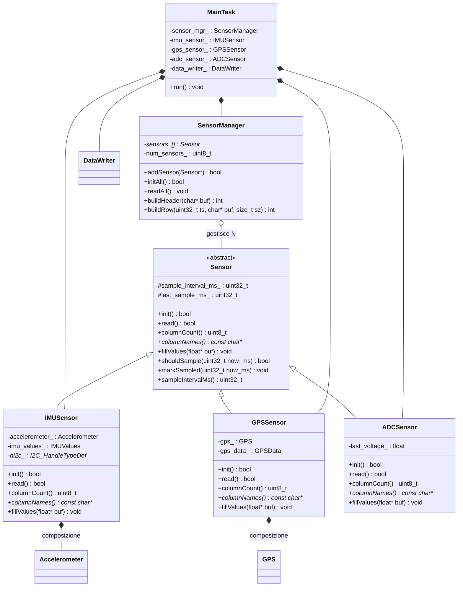

# Architettura modulare per acquisizione sensori

## Situazione attuale

Il loop principale in `CM7/Core/Src/MainTask.cpp` gestisce tutti i sensori in modo monolitico:
ogni sensore e' cablato direttamente nel loop, la stringa CSV e' costruita a mano con `snprintf`,
e tutti i sensori vengono letti alla stessa frequenza (ogni 5 ms) anche se il GPS opera a soli 4 Hz.

Aggiungere un nuovo sensore richiede di modificare `MainTask.hpp`, `MainTask.cpp` e la riga di formattazione CSV.

---

## Architettura proposta

L'idea e' introdurre:

1. Una **classe base astratta `Sensor`** con interfaccia comune per tutti i sensori.
2. **Classi concrete** (wrapper) per ogni tipo di sensore (`IMUSensor`, `GPSSensor`, `ADCSensor`, ...).
3. Un **`SensorManager`** che gestisce un array di sensori, le loro frequenze di campionamento,
   e genera automaticamente header e righe CSV.

Ogni sensore dichiara il proprio intervallo di campionamento. Se un sensore non deve essere letto
in un dato tick, `fillValues()` restituisce l'ultimo valore valido (ripetizione automatica).

---

## Diagramma delle classi



---

## Interfaccia della classe base Sensor

```cpp
class Sensor {
public:
    explicit Sensor(uint32_t sample_interval_ms)
        : sample_interval_ms_(sample_interval_ms) {}
    virtual ~Sensor() = default;

    virtual bool     init()                       = 0;
    virtual bool     read()                       = 0;
    virtual uint8_t  columnCount() const          = 0;
    virtual const char** columnNames() const      = 0;
    virtual void     fillValues(float* buf) const = 0;

    bool shouldSample(uint32_t now_ms) const {
        return (now_ms - last_sample_ms_) >= sample_interval_ms_;
    }
    void markSampled(uint32_t now_ms) { last_sample_ms_ = now_ms; }
    uint32_t sampleIntervalMs() const { return sample_interval_ms_; }

protected:
    uint32_t sample_interval_ms_;
    uint32_t last_sample_ms_ = 0;
};
```

---

## Flusso dati a runtime

```mermaid
sequenceDiagram
    participant Loop as MainTask Loop
    participant SM as SensorManager
    participant IMU as IMUSensor_5ms
    participant GPS_S as GPSSensor_250ms
    participant ADC as ADCSensor_5ms
    participant DW as DataWriter

    Loop ->> SM: readAll(now=100ms)
    SM ->> IMU: shouldSample? SI -> read()
    SM ->> GPS_S: shouldSample? NO -> skip
    SM ->> ADC: shouldSample? SI -> read()

    Loop ->> SM: buildRow(ts, buf)
    SM ->> IMU: fillValues() -> valori nuovi
    SM ->> GPS_S: fillValues() -> ultimo valore ripetuto
    SM ->> ADC: fillValues() -> valori nuovi
    SM -->> Loop: riga CSV completa

    Loop ->> DW: writeBatch(row)
```

---

## Gestione delle frequenze

| Sensore    | Frequenza | Intervallo | Colonne                          |
|------------|-----------|------------|----------------------------------|
| IMUSensor  | 200 Hz    | 5 ms       | ax, ay, az, wx, wy, wz          |
| GPSSensor  | 4 Hz      | 250 ms     | lat, lon, alt_m                  |
| ADCSensor  | 200 Hz    | 5 ms       | volt_travel_rear                 |

Il loop principale gira alla frequenza del sensore piu veloce (5 ms).
Ad ogni iterazione `SensorManager::readAll()` controlla per ogni sensore se e' il momento di campionare:

- **SI**: chiama `read()` per aggiornare i dati interni, poi `markSampled(now)`.
- **NO**: non fa nulla. Quando `buildRow()` chiama `fillValues()`, il sensore restituisce
  l'ultimo valore letto, che viene quindi **ripetuto** nella riga CSV.

Questo garantisce che ogni riga abbia sempre lo stesso numero di colonne, con i sensori lenti
che mantengono il loro ultimo valore valido fino al prossimo aggiornamento.

---

## Come aggiungere un nuovo sensore

1. Creare una nuova classe che eredita da `Sensor` (es. `TemperatureSensor`).
2. Implementare i 5 metodi virtuali: `init()`, `read()`, `columnCount()`, `columnNames()`, `fillValues()`.
3. Istanziarla in `MainTask` con l'intervallo di campionamento desiderato.
4. Aggiungerla al manager con `sensor_mgr_.addSensor(&temp_sensor_)`.

Nessun'altra modifica necessaria: header CSV e righe dati si adattano automaticamente.

---

## MainTask semplificato (pseudo-codice)

```cpp
void MainTask::run() {
    // Registra i sensori con le rispettive frequenze
    sensor_mgr_.addSensor(&imu_sensor_);    // 5 ms
    sensor_mgr_.addSensor(&gps_sensor_);    // 250 ms
    sensor_mgr_.addSensor(&adc_sensor_);    // 5 ms
    sensor_mgr_.initAll();

    // Header CSV generato automaticamente
    char header[256];
    sensor_mgr_.buildHeader(header);
    data_writer_.init("logaccgps", header);

    while (true) {
        uint32_t ts = HAL_GetTick();

        sensor_mgr_.readAll();   // legge solo chi deve essere letto

        char row[512];
        sensor_mgr_.buildRow(ts, row, sizeof(row));
        data_writer_.writeBatch(row);

        // gestione bottone stop ...

        vTaskDelay(pdMS_TO_TICKS(5));
    }
}
```

---

## File coinvolti nel refactoring

| File | Azione |
|------|--------|
| `CM7/Core/Inc/Sensor.hpp` | Nuovo -- classe base astratta |
| `CM7/Core/Inc/SensorManager.hpp` + `Src/SensorManager.cpp` | Nuovo -- gestore sensori |
| `CM7/Core/Inc/IMUSensor.hpp` + `Src/IMUSensor.cpp` | Nuovo -- wrapper attorno a Accelerometer |
| `CM7/Core/Inc/GPSSensor.hpp` + `Src/GPSSensor.cpp` | Nuovo -- wrapper attorno a GPS |
| `CM7/Core/Inc/ADCSensor.hpp` + `Src/ADCSensor.cpp` | Nuovo -- wrapper attorno a ADC3 |
| `CM7/Core/Inc/MainTask.hpp` | Modifica -- usa SensorManager |
| `CM7/Core/Src/MainTask.cpp` | Modifica -- loop semplificato |
| `CM7/Core/Inc/Accelerometer.hpp` | Invariato |
| `CM7/Core/Src/Accelerometer.cpp` | Invariato |
| `CM7/Core/Inc/GPS.hpp` | Invariato |
| `CM7/Core/Src/GPS.cpp` | Invariato |
| `CM7/Core/Inc/adc3_init.hpp` | Invariato |
| `CM7/Core/Src/adc3_init.cpp` | Invariato |
